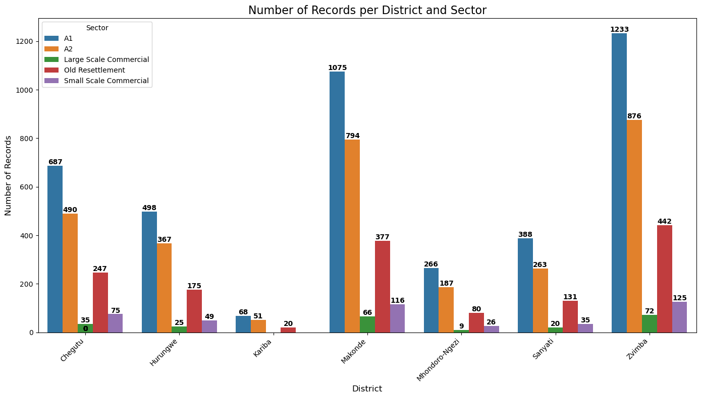
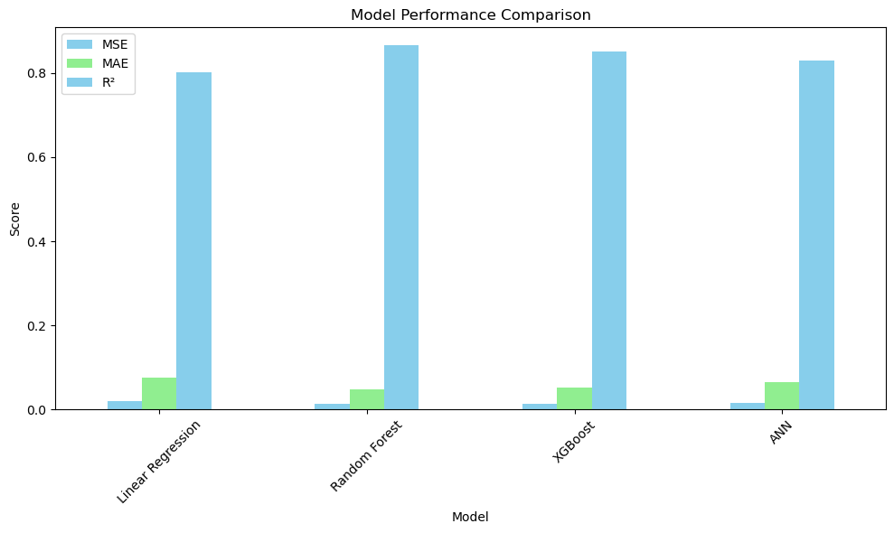
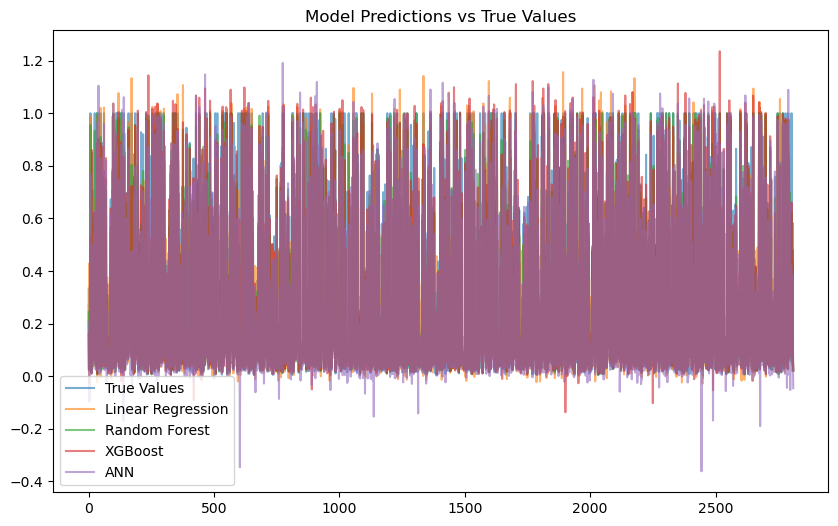
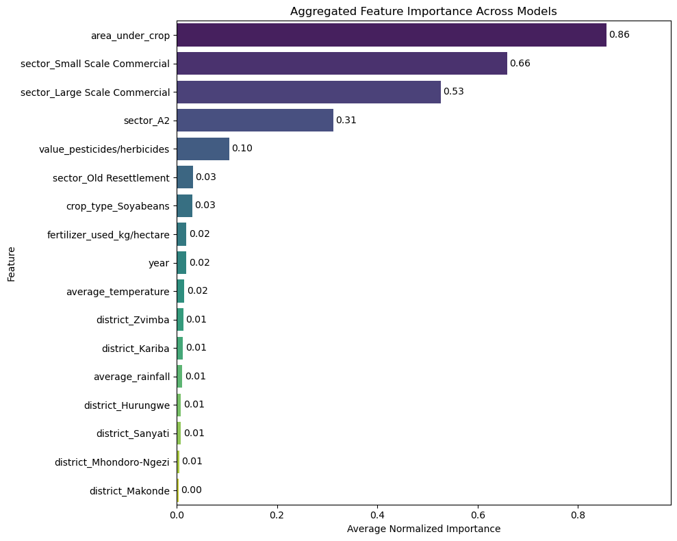

# A COMPARATIVE ANALYSIS OF MACHINE LEARNING MODELS FOR PREDICTING MAIZE AND SOYABEAN CROP YIELDS: A CASE OF MASHONALAND WEST

## Author: Tinotenda Linton Machila (C18132388U)

## Table of Contents
- [Introduction](#introduction)
- [Research Aim](#research-aim)
- [Research Objectives](#research-objectives)
- [Research Questions](#research-questions)
- [Methodology](#methodology)
- [Dataset](#dataset)
- [Machine Learning Models](#machine-learning-models)
- [Evaluation Metrics](#evaluation-metrics)
- [Results](#results)
- [Conclusions and Recommendations](#conclusions-and-recommendations)
- [Installation and Usage](#installation-and-usage)
- [References](#references)

---

## Introduction
Agriculture plays a crucial role in Zimbabwe’s economy, contributing significantly to GDP, employment, and food security. However, declining maize and soyabean yields in Mashonaland West due to climate variability, poor farming practices, and limited adoption of modern technologies necessitate innovative solutions. This research leverages machine learning to predict crop yields and identify key influencing factors, aiming to provide actionable insights for farmers and policymakers.

## Research Aim
To perform a comparative analysis of XGBoost, Linear Regression, Random Forest, and Artificial Neural Network (ANN) models for predicting maize and soyabean crop yields in Mashonaland West.

## Research Objectives
1. Identify factors affecting maize and soyabean crop yields in Mashonaland West.
2. Design XGBoost, Linear Regression, Random Forest, and ANN yield prediction models.
3. Develop XGBoost, Linear Regression, Random Forest, and ANN yield prediction models.
4. Determine the best-performing model for yield prediction.

## Research Questions
1. What factors influence maize and soyabean crop yields in Mashonaland West?
2. How can XGBoost, Linear Regression, Random Forest, and ANN models be designed for yield prediction?
3. How can these models be developed and implemented?
4. Which model is the most effective for yield prediction?

## Methodology
This study follows the **CRISP-DM framework**, which includes:
- **Data Collection**: Obtaining climatic, management, and crop-specific data from Mashonaland West’s seven districts.
- **Data Preprocessing**: Cleaning, normalizing, and encoding data for model training.
- **Model Training**: Using Python-based machine learning libraries to train models.
- **Model Evaluation**: Comparing models using performance metrics such as **MSE, MAE, and R²-score**.

## Dataset
The dataset includes agricultural data from the seven districts of Mashonaland West:
- Chegutu
- Hurungwe
- Kadoma
- Kariba
- Makonde
- Mhondoro-Ngezi
- Zvimba

Key variables include:
- **Climatic factors**: Rainfall, temperature, humidity.
- **Management factors**: Use of fertilizers, pesticides, herbicides.
- **Crop-specific factors**: Area under cultivation, farming scale (small-scale, large-scale, A2).



## Machine Learning Models
Four machine learning models were implemented:
1. **Linear Regression (LR)**: A simple yet interpretable model for understanding linear relationships.
2. **Random Forest (RF)**: A powerful ensemble method that handles non-linearity well.
3. **XGBoost (XGB)**: A boosting algorithm optimized for predictive performance.
4. **Artificial Neural Networks (ANNs)**: A deep learning approach capable of capturing complex patterns.

## Evaluation Metrics
The models were evaluated using the following metrics:
- **Mean Square Error (MSE)**: Measures the average squared difference between predicted and actual values.
- **Mean Absolute Error (MAE)**: Measures the average absolute difference between predicted and actual values.
- **R²-score**: Indicates the proportion of variance explained by the model.

## Results
The models performed as follows:

| Model          | R²-score |
|---------------|---------|
| Random Forest | **0.8753** |
| XGBoost       | 0.8709 |
| ANN           | 0.8481 |
| Linear Regression | 0.7254 |



**Key Findings:**
- **Random Forest** outperformed other models with an R²-score of 0.8753.
- **XGBoost** closely followed, making it a viable alternative.
- **ANN** captured complex relationships but required more data tuning.
- **Linear Regression**, while interpretable, struggled with non-linearity.



## Feature Importance
Feature importance was calculated to understand the contribution of each feature to the predictions.



## Conclusions and Recommendations
- **Key Yield Determinants:** Area under cultivation, farming scale, and pesticide/herbicide value.
- **Best Model:** Random Forest is recommended for yield prediction in Mashonaland West.
- **Policy Implications:**
  - Promote **data-driven decision-making** in agriculture.
  - Encourage **technology adoption** for precision farming.
  - Invest in **climate resilience strategies**.

## Installation and Usage

### Prerequisites
Ensure you have the following installed:
- Python (>=3.8)
- Jupyter Notebook
- Required libraries: `numpy`, `pandas`, `scikit-learn`, `xgboost`, `tensorflow`, `matplotlib`, `seaborn`

### Installation
1. Clone the repository:
   ```bash
   git clone https://github.com/tinolinton/Yield-Predictive-Model.git
   cd Yield-Predictive-Model
